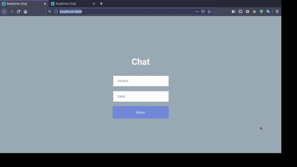

  

  

 🚀 <strong>Realtime Chat</strong> 🚧
 

 
 

   
  
  
 
 

  

# :pushpin: Índice

- [Projeto](#sobre)
- [Tecnologias](#tecnologias)
- [Deploy](#deploy)
- [Licença](#licenca)
- [Autor](#autor)

 

# 💻 Projeto

Este projeto foi feito com base nas video aulas do canal [JavaScript Mastery](https://www.youtube.com/channel/UCmXmlB4-HJytD7wek0Uo97A)

Um Chat com funcionamento em tempo real com ReactJS e Socket.io.

 

# :rocket: Tecnologias

Esse projeto foi desenvolvido com as seguintes tecnologias:

- [React](https://reactjs.org)
- [Socket.io](https://socket.io/)

 

# :bulb: Deploy 
Caso deseje acessar o deploy do projeto, utilize o link abaixo:

[Chat com aplicação Realtime](https://musing-tereshkova-2d7aef.netlify.app/)

 

# :memo: Licença

Este projeto está sob a licença do MIT. Veja a [página de licença] (https://opensource.org/licenses/MIT) para mais detalhes.

 

# 🦸 Autor
        
 

Feito com ❤️ por Savio Lopes 👋🏽 [Entre em contato!](https://www.linkedin.com/in/savio-lopes/)
